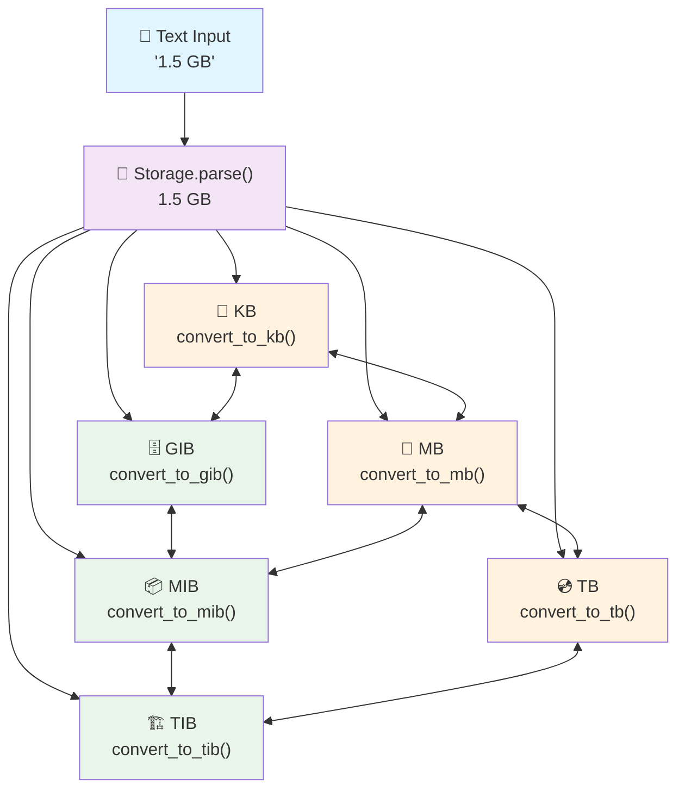

<div align="center">

# filesizelib

[](https://python.org)
[](https://opensource.org/licenses/MIT)
[](https://mypy.readthedocs.io/)

</div>

## Features

- 📦 **Comprehensive Unit Support**: Binary (KiB, MiB, GiB...), decimal (KB, MB, GB...), and bit units
- 🧮 **Smart Arithmetic Support**: Same-unit operations preserve units (1 GB + 2 GB = 3 GB), mixed units convert automatically
- 🎯 **Configurable Precision**: Eliminate scientific notation with configurable decimal precision (no more 1.23e-05 GB!)
- 📝 **Flexible String Parsing**: Case-insensitive parsing with support for various formats and separators
- 🔗 **Cross-Platform File Operations**: Get file and directory sizes using `pathlib` with platform-specific optimizations
- ⚡ **Platform-Specific Optimizations**: Windows, Linux, and macOS-specific implementations for better performance
- 🔒 **Type Safety**: Complete type annotations for better IDE support and code safety
- 🎯 **Zero Dependencies**: Uses only Python standard library

## Installation

```bash
pip install filesizelib
```

## Quick Start

```python
from filesizelib import Storage, StorageUnit

# Create and convert units
size = Storage.parse("1.5 GB")              # 1.5 GB
print(size.convert_to_gib())                # 1.396 GIB
print(size.convert_to_mb())                 # 1500.0 MB  
print(size.convert_to_tb())                 # 0.0015 TB

# Smart arithmetic and file operations
file_size = Storage.get_size_from_path(".")  # Get directory size
total = size + file_size                     # Add sizes
print(f"Total: {total.auto_scale()}")       # Auto-scale for readability
```

## Unit Conversion Flow



## Supported Units

### Binary Units (Base 1024)
- `BYTES` (1 byte)
- `KIB` (1,024 bytes)
- `MIB` (1,048,576 bytes)
- `GIB`, `TIB`, `PIB`, `EIB`, `ZIB`, `YIB`

### Decimal Units (Base 1000)
- `KB` (1,000 bytes)
- `MB` (1,000,000 bytes)
- `GB` (1,000,000,000 bytes)
- `TB`, `PB`, `EB`, `ZB`, `YB`

### Bit Units
- `BITS` (1/8 byte)
- `KILOBITS`, `MEGABITS`, `GIGABITS`, `TERABITS`, `PETABITS`, `EXABITS`, `ZETTABITS`, `YOTTABITS`

## Advanced Usage

### Comprehensive Examples

```python
from filesizelib import Storage, StorageUnit, FileSizeLib

# Create storage values
storage1 = Storage(1, StorageUnit.KIB)
storage2 = Storage(512, StorageUnit.BYTES)

# FileSizeLib is an alias for Storage - both are functionally identical
filesize = FileSizeLib(1024, StorageUnit.BYTES)
print(storage1 == filesize)  # True

# Smart arithmetic - same units preserve unit, mixed units convert to bytes
same_unit_total = Storage(1, StorageUnit.GB) + Storage(2, StorageUnit.GB)  # 3 GB (preserved!)
mixed_unit_total = storage1 + storage2  # 1536 BYTES (converted)
doubled = storage1 * 2  # 2 KIB

# Comparisons
print(storage1 > storage2)  # True
print(storage1 == Storage(1024, StorageUnit.BYTES))  # True

# Unit conversion
print(storage1.convert_to_bytes())  # 1024.0
print(storage2.convert_to(StorageUnit.KIB))  # 0.5 KIB

# String parsing (flexible formats)
size1 = Storage.parse("1.5 MB")      # 1.5 MB
size2 = Storage.parse("1,024 KiB")   # 1024.0 KIB (comma as decimal separator)
size3 = Storage.parse("500GB")       # 500.0 GB (no space)
size4 = Storage.parse("2.5 tb")      # 2.5 TB (case insensitive)
size5 = Storage.parse("1024")        # 1024.0 BYTES (defaults to bytes)

# Auto-scaling for human-readable output
large_size = Storage(1536000000, StorageUnit.BYTES)
print(large_size.auto_scale())  # 1.43 GIB (binary) or 1.536 GB (decimal)

# Decimal precision control (eliminates scientific notation)
Storage.set_decimal_precision(5)  # Configure precision globally
small_value = Storage(9.872019291e-05, StorageUnit.GIB)
print(f"Precise: {small_value}")  # 0.0001 GIB (no scientific notation!)

# File operations
file_size = Storage.get_size_from_path("/path/to/file.txt")
dir_size = Storage.get_size_from_path("/path/to/directory")
print(f"Directory size: {dir_size.auto_scale()}")
```

### Platform-Specific Optimizations

```python
from filesizelib import Storage

# Automatically detect and use platform-specific optimizations
platform_storage = Storage.get_platform_storage()
size = platform_storage.get_size_from_path("/large/directory")

# Platform info
info = platform_storage.get_platform_info()
print(f"Platform: {info['platform']}")
print(f"Optimizations: {info.get('api_optimization', 'none')}")
```

### String Parsing Features

The `parse()` method supports various input formats:

```python
from filesizelib import Storage, StorageUnit

# Case insensitive
Storage.parse("1.5 mb")      # Works
Storage.parse("1.5 MB")      # Works
Storage.parse("1.5 Mb")      # Works

# Decimal separators
Storage.parse("1.5 MB")      # Dot separator
Storage.parse("1,5 MB")      # Comma separator

# Spacing
Storage.parse("1.5 MB")      # With space
Storage.parse("1.5MB")       # Without space

# Default unit
Storage.parse("1024")        # Defaults to bytes
Storage.parse("1024", StorageUnit.KIB)  # Custom default

# Comprehensive unit aliases
Storage.parse("1 kilobyte")  # Full name
Storage.parse("1 kb")        # Abbreviation
Storage.parse("1 k")         # Single letter
```

### Error Handling

```python
from filesizelib import Storage, StorageUnit

# Invalid values raise appropriate exceptions
try:
    Storage(-1, StorageUnit.BYTES)  # Raises ValueError
except ValueError as e:
    print(f"Error: {e}")

try:
    Storage.parse("invalid")  # Raises ValueError
except ValueError as e:
    print(f"Parsing error: {e}")

try:
    storage = Storage(1, StorageUnit.KIB)
    result = storage / 0  # Raises ZeroDivisionError
except ZeroDivisionError as e:
    print(f"Division error: {e}")
```

## Real-World Examples

### Download Time Calculator

FileSizeLib is the same thing as Storage, so you can use either interchangeably.

```python
from filesizelib import FileSizeLib

# File sizes
movie = FileSizeLib.parse("1.4 GB")
song = FileSizeLib.parse("4.5 MB")

# Network speeds (in bits per second)
broadband = FileSizeLib.parse("50 Megabits")  # 50 Mbps
fiber = FileSizeLib.parse("1 Gigabit")        # 1 Gbps

# Calculate download times
movie_time_broadband = movie / broadband  # seconds
movie_time_fiber = movie / fiber          # seconds

print(f"Movie download time:")
print(f"  Broadband (50 Mbps): {movie_time_broadband:.1f} seconds")
print(f"  Fiber (1 Gbps): {movie_time_fiber:.1f} seconds")
```

### Storage Capacity Planning

```python
from filesizelib import FileSizeLib

# Calculate total storage needs
photos = FileSizeLib.parse("2.8 MiB") * 2000      # 2000 photos
music = FileSizeLib.parse("4.5 MB") * 500         # 500 songs
videos = FileSizeLib.parse("1.2 GB") * 50         # 50 videos
documents = FileSizeLib.parse("250 KB") * 1000    # 1000 documents

total_needed = photos + music + videos + documents
print(f"Total storage needed: {total_needed.auto_scale()}")

# Available storage
available = FileSizeLib.parse("500 GB")
remaining = available - total_needed
print(f"Remaining space: {remaining.auto_scale()}")
```

## Development

### Running Tests

```bash
# Run basic functionality tests
python test_basic_functionality.py
```

### Building and Installation

please install uv first

```bash
# Install development dependencies
uv sync
```

## License

This project is licensed under the MIT License - see the [LICENSE](LICENSE) file for details.