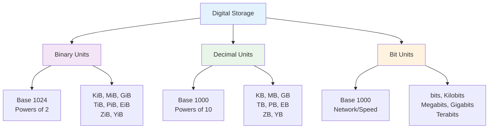
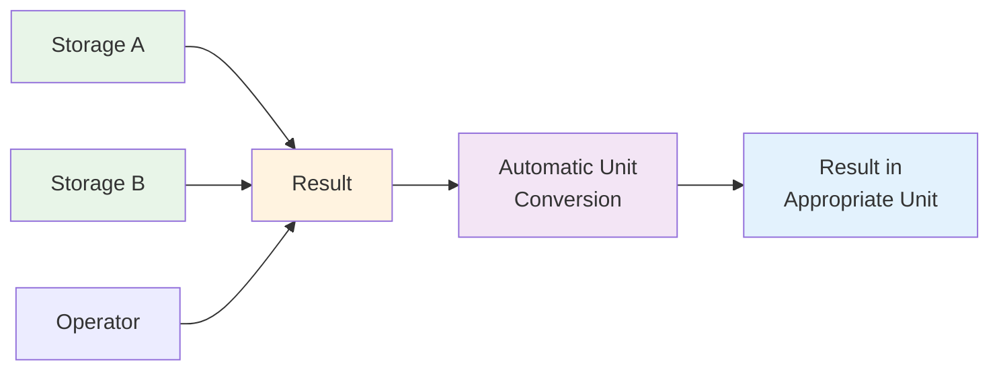
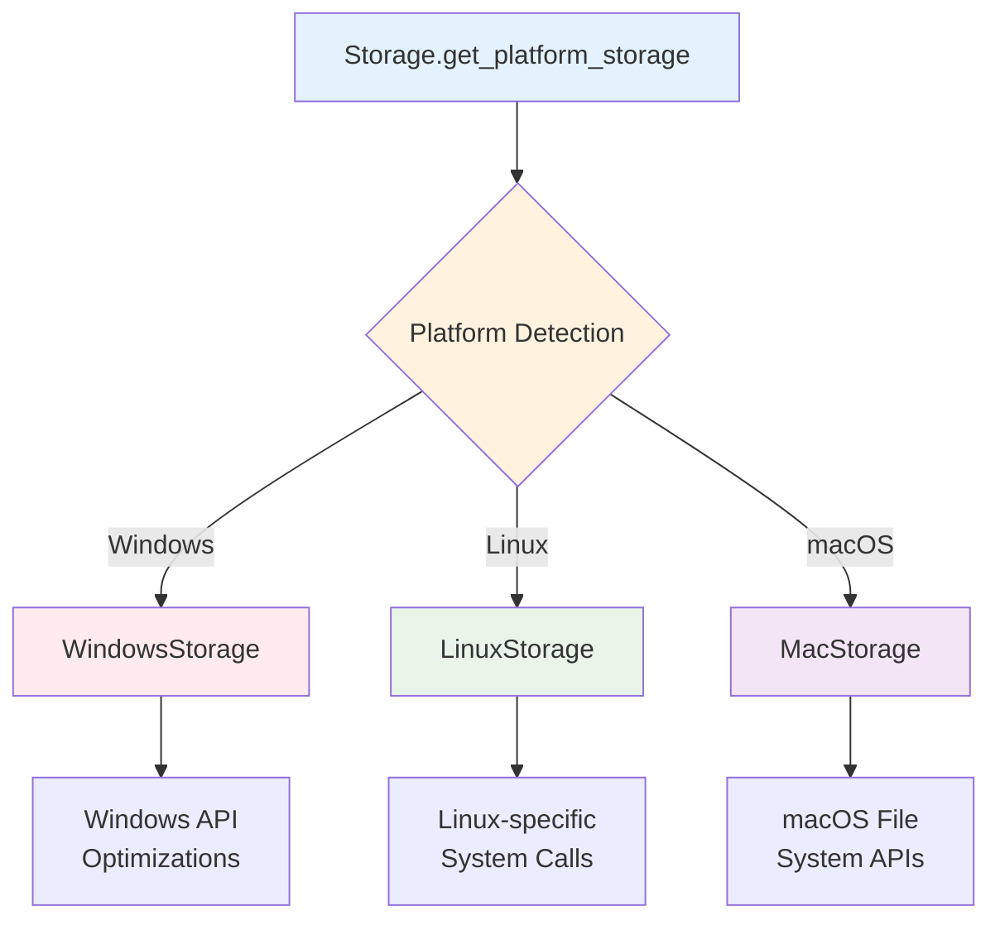

# Basic Concepts

Understanding the core concepts behind Bytesize will help you use the library more effectively.

## 🧠 Storage Units Overview

Storage units represent different ways to measure digital information. Bytesize supports three main categories:



## 📊 Binary vs Decimal Units

One of the most important concepts to understand is the difference between binary and decimal units:

### Binary Units (Base 1024)

Binary units use powers of 2 and are denoted with "i" (binary):

| Unit | Full Name | Value | Bytes |
|------|-----------|-------|-------|
| B | Byte | 1 | 1 |
| KiB | Kibibyte | 1024¹ | 1,024 |
| MiB | Mebibyte | 1024² | 1,048,576 |
| GiB | Gibibyte | 1024³ | 1,073,741,824 |
| TiB | Tebibyte | 1024⁴ | 1,099,511,627,776 |

### Decimal Units (Base 1000)

Decimal units use powers of 10 and are more commonly used by manufacturers:

| Unit | Full Name | Value | Bytes |
|------|-----------|-------|-------|
| B | Byte | 1 | 1 |
| KB | Kilobyte | 1000¹ | 1,000 |
| MB | Megabyte | 1000² | 1,000,000 |
| GB | Gigabyte | 1000³ | 1,000,000,000 |
| TB | Terabyte | 1000⁴ | 1,000,000,000,000 |

### Why the Difference Matters

```python
from bytesize import Storage, StorageUnit

# A "1 GB" hard drive actually has different capacities:
decimal_gb = Storage(1, StorageUnit.GB)  # 1,000,000,000 bytes
binary_gib = Storage(1, StorageUnit.GIB) # 1,073,741,824 bytes

print(f"1 GB = {decimal_gb.convert_to_bytes():,.0f} bytes")
print(f"1 GiB = {binary_gib.convert_to_bytes():,.0f} bytes")
print(f"Difference: {(binary_gib - decimal_gb).convert_to_bytes():,.0f} bytes")

# Output:
# 1 GB = 1,000,000,000 bytes
# 1 GiB = 1,073,741,824 bytes  
# Difference: 73,741,824 bytes
```

!!! info "Real-World Impact"
    This is why a "500 GB" hard drive might show as only ~465 GiB in your operating system!

## 💾 The Storage Class

The `Storage` class is the heart of Bytesize. It represents a storage value with these key properties:

### Core Components

```python
from bytesize import Storage, StorageUnit

storage = Storage(1.5, StorageUnit.GB)

# Core properties
print(f"Value: {storage.value}")  # 1.5
print(f"Unit: {storage.unit}")    # StorageUnit.GB
print(f"Bytes: {storage.convert_to_bytes()}")  # 1500000000.0
```

### Immutability

Storage objects are **immutable** - operations return new objects:

```python
original = Storage(1, StorageUnit.GB)
doubled = original * 2

print(f"Original: {original}")  # 1.0 GB (unchanged)
print(f"Doubled: {doubled}")    # 2.0 GB (new object)
```

### Type Safety

Bytesize provides complete type annotations for better IDE support:

```python
from bytesize import Storage, StorageUnit
from typing import Union

def calculate_bandwidth(file_size: Storage, time_seconds: float) -> Storage:
    """Calculate bandwidth given file size and time."""
    bytes_per_second = file_size.convert_to_bytes() / time_seconds
    return Storage.parse_from_bytes(bytes_per_second)
```

## 🔄 Conversion Philosophy

Bytesize provides two approaches to unit conversion:

### 1. Explicit Conversion

```python
storage = Storage(1, StorageUnit.GB)

# Traditional method - explicit and clear
mb_storage = storage.convert_to(StorageUnit.MB)
print(f"Explicit: {mb_storage}")  # 1000.0 MB
```

### 2. Convenient Methods

```python
# Convenient methods - shorter and more readable
mb_storage = storage.convert_to_mb()
print(f"Convenient: {mb_storage}")  # 1000.0 MB

# Both produce identical results
assert storage.convert_to(StorageUnit.MB) == storage.convert_to_mb()
```

### Auto-Scaling

Bytesize can automatically choose the best unit for display:

```python
large_file = Storage(1536000000, StorageUnit.BYTES)

# Auto-scale chooses the most readable unit
print(f"Auto-scaled: {large_file.auto_scale()}")  # 1.43 GIB

# You can prefer binary or decimal
binary = large_file.auto_scale(prefer_binary=True)   # 1.43 GIB
decimal = large_file.auto_scale(prefer_binary=False) # 1.536 GB
```

## 🧮 Arithmetic Operations

Bytesize supports natural arithmetic operations with automatic unit handling:

### Basic Operations



### Unit Handling Rules

1. **Addition/Subtraction**: Result uses the unit that produces the most readable value
2. **Multiplication**: Result keeps the storage unit (factor is dimensionless)
3. **Division**: Can return Storage (when dividing by a number) or float (when dividing by Storage)

```python
file1 = Storage(1.5, StorageUnit.GB)
file2 = Storage(512, StorageUnit.MB)

# Addition - automatic unit selection
total = file1 + file2
print(f"Total: {total}")  # 2012.0 MB (readable unit chosen)

# Division - different result types
per_chunk = file1 / 3      # Storage object
ratio = file1 / file2      # float ratio

print(f"Per chunk: {per_chunk}")  # 0.5 GB
print(f"Ratio: {ratio:.2f}")       # 2.93
```

## 📁 File System Integration

Bytesize integrates seamlessly with Python's file system operations:

### Path Handling

```python
from pathlib import Path
from bytesize import Storage

# Works with strings and Path objects
file_size = Storage.get_size_from_path("README.md")
dir_size = Storage.get_size_from_path(Path("./docs"))

print(f"File: {file_size.auto_scale()}")
print(f"Directory: {dir_size.auto_scale()}")
```

### Platform Optimizations

Bytesize provides platform-specific optimizations:



## 🔤 String Parsing Flexibility

Bytesize's string parser is designed to handle real-world input:

### Supported Formats

```python
# All of these work:
sizes = [
    Storage.parse("1.5 GB"),      # Standard format
    Storage.parse("1.5GB"),       # No space
    Storage.parse("1,5 GB"),      # European decimal
    Storage.parse("1.5 gb"),      # Lowercase
    Storage.parse("1.5 gigabytes"), # Full name
    Storage.parse("1.5 g"),       # Single letter
    Storage.parse("1536"),        # Just number (bytes)
]
```

### Parser Rules

1. **Case insensitive**: `GB`, `gb`, `Gb` all work
2. **Flexible spacing**: Space optional between number and unit
3. **Multiple separators**: Both `.` and `,` accepted as decimal separators
4. **Unit aliases**: Full names, abbreviations, and single letters
5. **Default unit**: Numbers without units default to bytes

## 🎯 Design Philosophy

Bytesize follows these core principles:

### Pythonic

```python
# Natural, readable operations
total_size = file1 + file2 + file3
average_size = total_size / 3
is_large = file_size > Storage.parse("1 GB")
```

### Explicit is Better than Implicit

```python
# Clear about what units you're working with
bandwidth = Storage(100, StorageUnit.MEGABITS)  # Network speed
file_size = Storage(100, StorageUnit.MB)        # File size

# Explicit conversions
print(f"Bandwidth: {bandwidth.convert_to_megabits()}")
print(f"File size: {file_size.convert_to_mb()}")
```

### Zero Dependencies

Bytesize uses only Python's standard library, making it:
- Lightweight and fast to install
- More secure (fewer attack vectors)
- Highly compatible across Python versions
- Easy to audit and maintain

## 🚀 Performance Considerations

### Efficient Operations

```python
# These operations are optimized:
large_list = [Storage.parse(f"{i} MB") for i in range(1000)]
total = sum(large_list, Storage(0, StorageUnit.BYTES))  # Efficient sum

# Chaining is also optimized:
result = (Storage.parse("1 TB")
          .convert_to_gib()
          .convert_to_mb()
          .auto_scale())
```

### Platform Optimizations

Each platform-specific storage class provides optimized file operations:

- **Windows**: Uses Windows API for faster directory traversal
- **Linux**: Leverages Linux-specific system calls
- **macOS**: Uses native macOS file system APIs

## 📚 Next Steps

Now that you understand the core concepts:

<div class="grid cards" markdown>

-   [:material-book: **User Guide**](../user-guide/index.md)
    
    Explore all features in detail

-   [:material-lightbulb: **Examples**](../examples/index.md)
    
    See practical applications and patterns

-   [:material-api: **API Reference**](../api/index.md)
    
    Complete method and class documentation

-   [:material-school: **Best Practices**](../user-guide/best-practices.md)
    
    Performance tips and recommended patterns

</div>